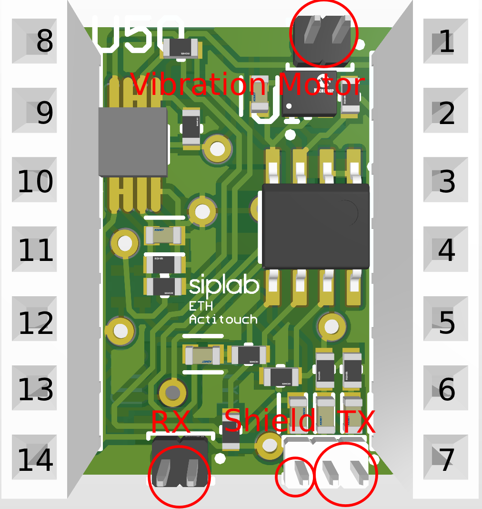
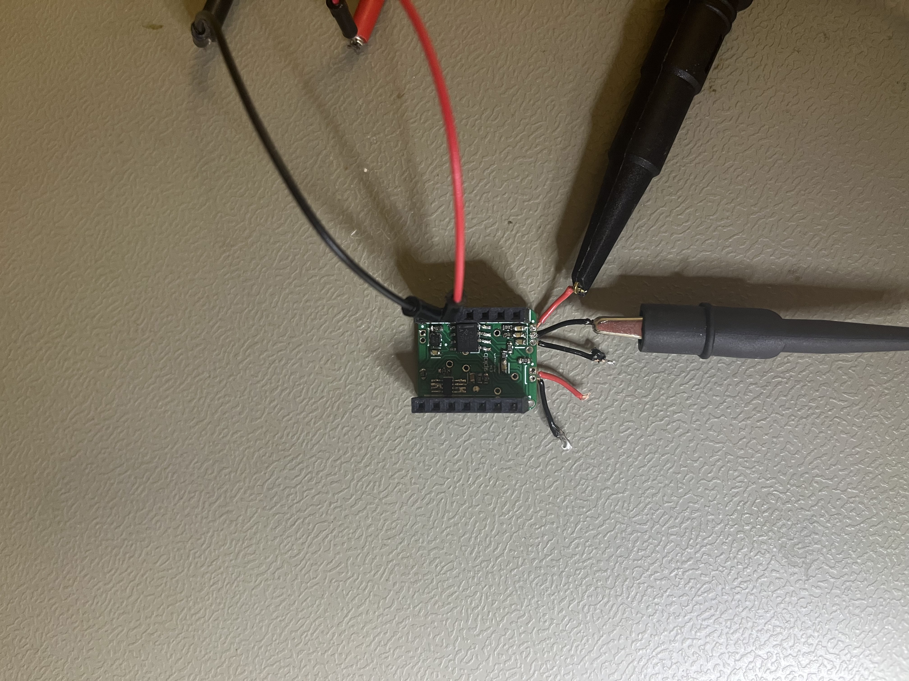
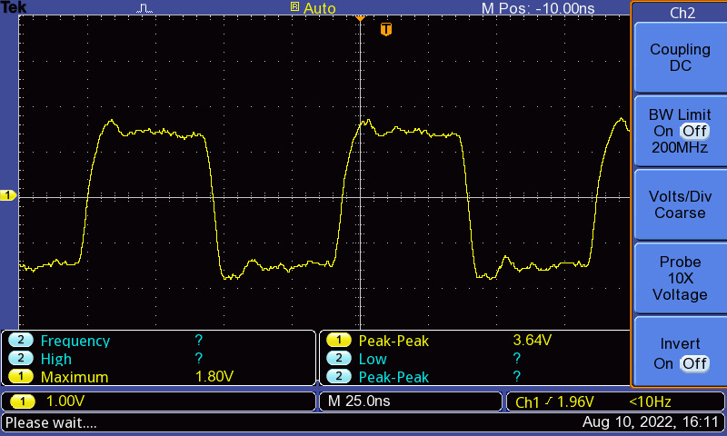
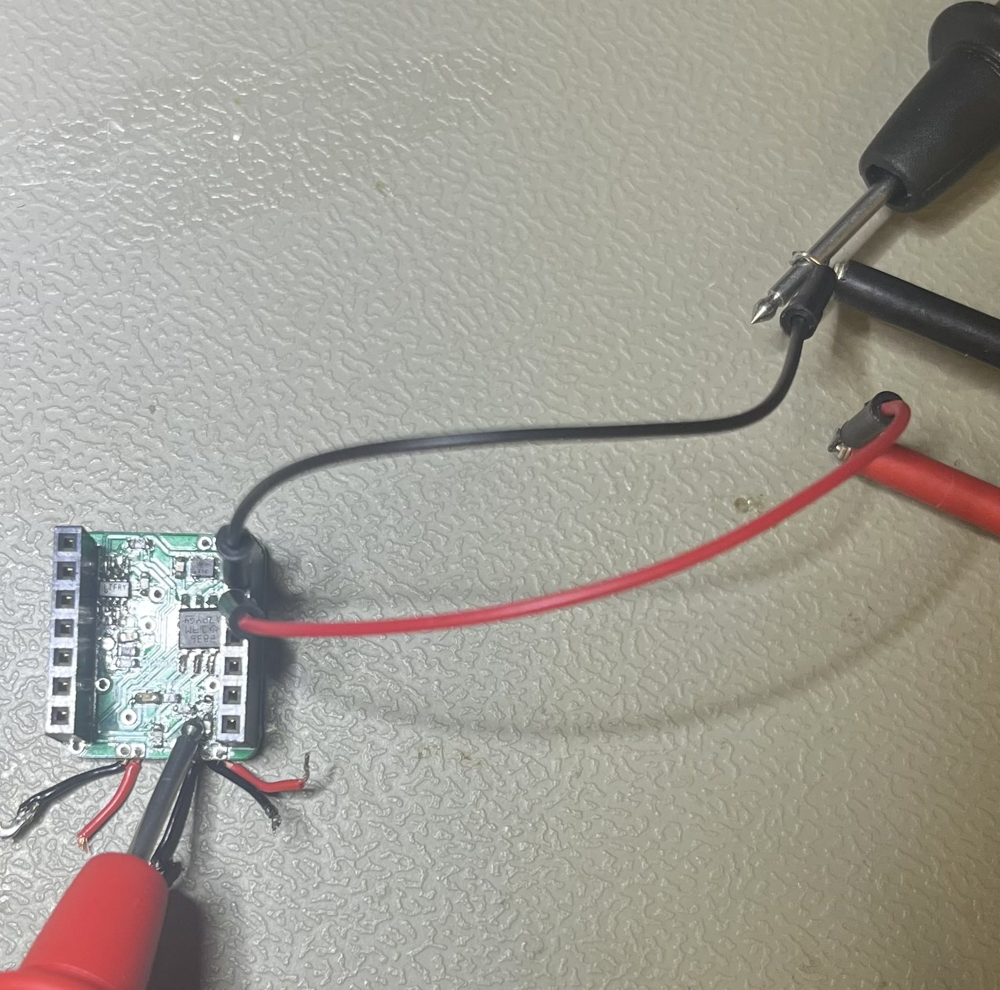
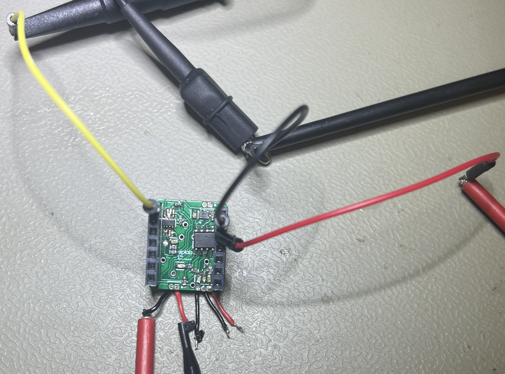
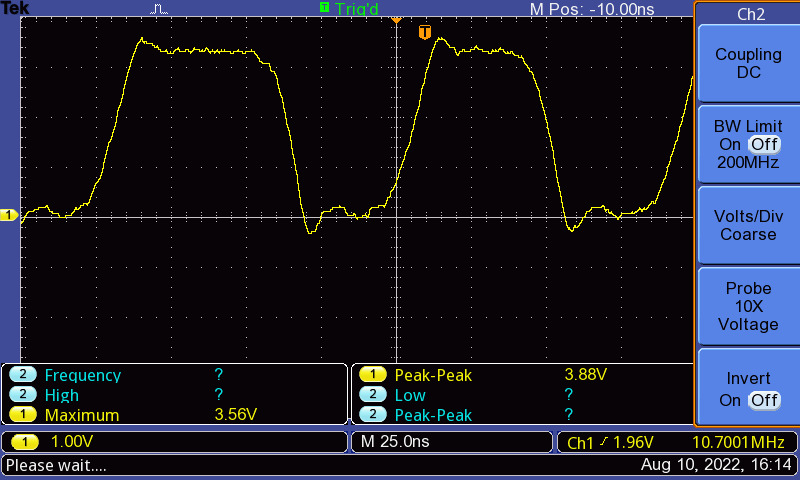

# ElectorRing - Touch detection by coupling RF Signal to body

The electric ring can be used to detect the pinching of one's own fingers or the pinching of other people. The principle of operation is based on a transmitter that couples a high frequency signal into the body, which is measured by a receiver and amplified 30 times. This signal is then read by a microcontroller and can send a signal to a PC via BLE. 

Here is an overview of the outputs of the PCB that was developed as part of the semester project. It serves as an overview for debugging and pin 1 of the Seeed XIAO BLE must be connected to pin 1 of the PCB. 

## Assembly
- The assembly instruction can be found [here](https://github.com/eth-siplab-students/t-st-2022-WearableTouchDetection-FabioBazzi/blob/master/source/Insturctions/Assembly%20instructions.pdf) 
- Upload the [code](https://github.com/eth-siplab-students/t-st-2022-WearableTouchDetection-FabioBazzi/blob/master/source/firmware/BLEDataSendToPeripheral/BLEDataSendToPeripheral.ino) on the ring
- Upload the [code](https://github.com/eth-siplab-students/t-st-2022-WearableTouchDetection-FabioBazzi/blob/master/source/firmware/BLEMouseController/BLEMouseController.ino) on the Seeed XIAO BLE connected to your PC

## Callibration
It may be that the default programme does not work as desired because the ring was calibrated to me at the beginning, this section explains how I went about calibrating the ring.
- Connect the ring to the computer and [upload and run]([https://github.com/eth-siplab-students/t-st-2022-WearableTouchDetection-FabioBazzi/blob/master/source/Arduino%20Code/BLEDataSendToPeripheral/BLEDataSendToPeripheral.ino](https://github.com/eth-siplab-students/t-st-2022-WearableTouchDetection-FabioBazzi/blob/master/source/Arduino%20Code/Callibration/Callibration.ino))
- Check what with the Serial Plotter of the Arduino what the Signal Strength of **Pinch** and **No Pinch** is
- Select the threshold value between pinch and no pinch. Set a suitable hysteresis to make the state more robust
- Edit the [code](https://github.com/eth-siplab-students/t-st-2022-WearableTouchDetection-FabioBazzi/blob/master/source/firmware/Callibration/Callibration.ino) and uplode

      #define HYST xx
      #define THRESHOLD xx 
      
## Further development
- Improve the ceramic filter problem by perhaps converting it to a high-pass filter that filters frequencies below a certain threshold.
- Instead of using the sum of the FFT to detect a detection, a digital Goertzel filter should be used. This requires less computing time than the FFT and is more frequency specific. That means instead of calculating the whole frequency spectrum only one frequency of the signal is not suppressed e.g. the undersampled 10.7 Mhz.
- Increase the sampling frequency of the Seeed XIAO BLE. Currently the sampling speed is limited by analog read. By rewriting the register of the microcontroller it should be possible to increase it up to 70 kHZ. 

## Debug
This section describes the bugs and debugging that I encountered while making the electro ring.
### Hardware
  - **Ceramic bandpass filter (10.7 MHZ):** It sometimes happened that the bandpass filter filtered the signal too much so that no signal could pass through the filter. In this case I have then shorted the filter with a cable .
  - **Soldering:** Make sure all solder joints are clean and in contact with the PCB. To test if the PCB is working, it is recommended to test the three sub-circuits (transmitter, receiver and shield) independently and see if they work. 
    - **Transmitter:** Connect ground to pin 2 and 3.3 V of the power supply to pin 3 and measure the signal at the transimitter output with the DSO. 
      

      
      
      The measured Signal should look similar to this:
      
      
      
    - **Shield:** Connect ground to pin 2 and 3.3 V of the power supply to pin 3 and measure the voltage behind the capacitor which leads to the shield output.
    
      
    
    - **Receiver:**  Connect ground to pin 2 and 3.3 V of the power supply to pin 3. Connect the frequency genrator with the receiver. Generate a sinusoidal signal with a frequency of 10.7 mhz and an amplitude of 50 mV. The gain of the receiver should amplify the signal by a factor of 30 and can be measured at pin 1 with the DSO.
    
      
    
      The measured Signal should look similar to this:
    
      
    
### Interface Seeed XIAO BLE and PC
 - **Board manager:** Make sure you have the latest version of Seeed XIAO BLE - nRF52840 board installed
 - **upload.tool.serial:** If you get the following error message when uploading your code to the Seeed XIAO BLE in the Arduino IDE 2.0.0, follow this [instruction](https://forum.arduino.cc/t/arduino-2-beta-12-stlink-programmer-error/921351) (at point 9. use this line **xiaonRF52840.upload.tool.default=nrfutil**)

